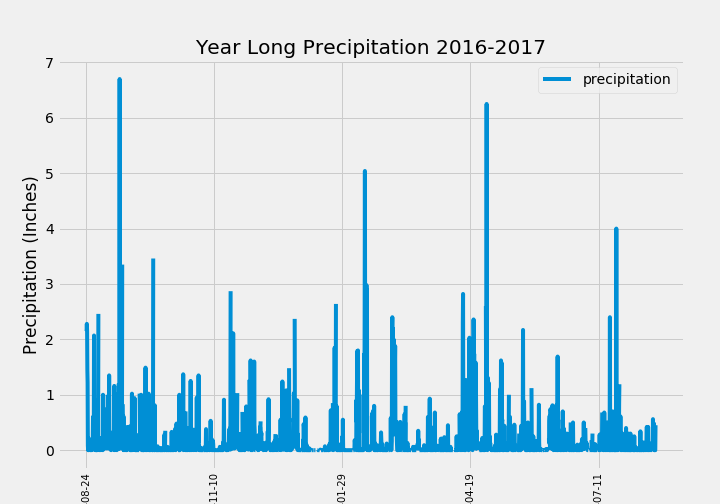

# Climate Data in America

**Purpose**

Create charts to  analyze climate data in America. Use sqlalchemy to store and present information on a local machine.

**Additional Information**

Used Python for the initial analysis code.  Used Sqllite/sqlachemy for the presentation.
